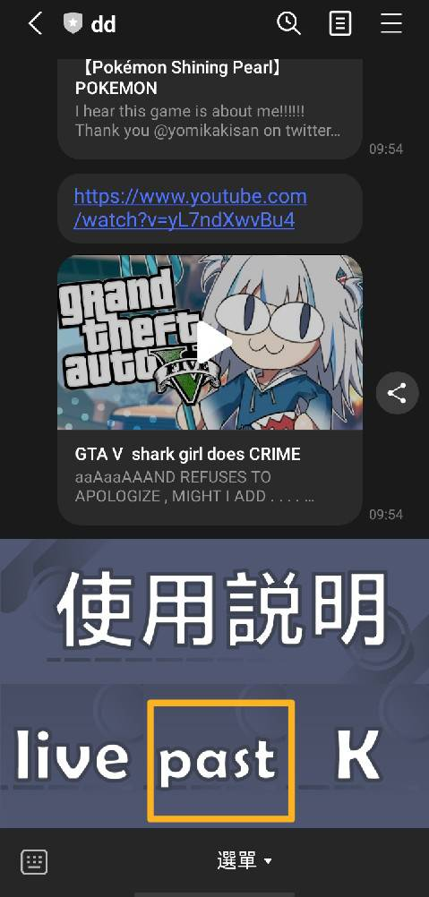

### :open_file_folder:基本資料

**:heavy_check_mark: 帳號名稱：** DD  
**:heavy_check_mark: LINE ID：**@025bkasf  
**:heavy_check_mark: LINE QRcode**  

  

**:heavy_check_mark: 機器人介紹**  
* 以日本經紀公司hololive經營的虛擬YouTuber爲主，因爲裡面每個人的直播時間都不同，有的人會在推特上發佈直播待機室，有的人會先公告直播行程表。有時候出門在外想聽直播，卻又不方便用手機直接找到主播的相關連結，就可以讓機器人直接告訴你這些資訊，或是不知道現在有哪些人在直播，也可以讓機器人告訴你。

---

**:grey_question: DD :grey_question:**
* DD黨取自日語“誰でも大好き” (Daredemo Daisuki）的羅馬字兩個首字母D，意思是“不管是誰都最喜歡”。
* 現在Vtuber和Vup圈中也有很多人在使用，意思約為喜歡/推所有Vtuber/Vup。
* 指同時廚多個偶像，而不是只廚某一個偶像的人。
* 是所謂的“多推黨”（博愛黨、複數推、全推黨）。

**:grey_question: hololive :grey_question:**
* 是日本科技公司COVER株式會社旗下的經紀公司品牌，以經營虛擬YouTuber為其主要業務，除了在日本外，也在其他地區擁有並經營VTuber。

---

### :open_file_folder:使用介紹
**:pushpin: 輸入「!intro」回傳使用說明**  

&emsp;    
**:pushpin: 輸入名字瞭解基本資料**  
&emsp;  › 名字（姓或是名）的第一個字母爲大寫  
&emsp;  › 包含官方照片、自我介紹、官網連結、推特和YouTube連結  

&emsp;     
**:pushpin: 輸入「!live」回傳正在直播的影片網址**  
&emsp;  › 隨機回傳正在直播的影片網址  
&emsp;  › 包含頻道名和連結網址  
&emsp;  › 最多回傳5筆資料  

&emsp;    
**:pushpin: 輸入「!past」past回傳ended直播影片網址**  
&emsp;  › 隨機回傳過去的直播影片網址  
&emsp;  › 包含頻道名和連結網址  
&emsp;  › 最多回傳5筆資料  

&emsp;    
**:pushpin: 輸入正在直播的頻道名字回覆直播的標題、開始時間跟同接人數**  
&emsp;  › title後有空格，名字的第一個字母爲大寫  

&emsp;   
**:pushpin: 輸入！upcoming回傳即將直播的影片網址**  
&emsp;  › 隨機回傳即將直播的影片網址  
&emsp;  › 不會回傳包含 free chat 和 schedule 標題的待機室網址  
&emsp;  › 包含頻道名、開始時間、直播標題和連結網址  
&emsp;  › 最多回傳5筆資料  

&emsp;   
**:pushpin: 特別按鈕**  
&emsp;  › 直接連結到YouTube網址  

&emsp;     

---
**:page_with_curl: 相關網址**  
&emsp;  [API](https://api.holotools.app/v1/live)  
&emsp;  [Holoapi Document](https://api.holotools.app/)  
&emsp;  [Hololive production](https://en.hololive.tv/)  
&emsp;  [萌娘百科，萬物皆可萌的百科全書（DD）](https://zh.moegirl.org.cn/index.php?title=DD%E5%85%9A&variant=zh-tw&mobileaction=toggle_view_desktop)  
&emsp;  [維基百科（hololive production）](https://zh.wikipedia.org/wiki/Hololive_production)
